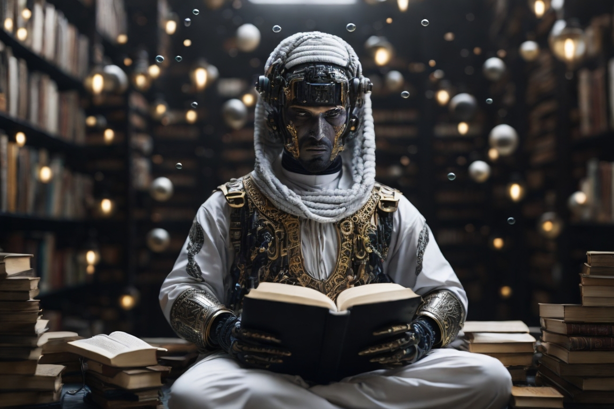

# Motarannem (*مترنّم)*

# Introduction *مقدمة*

لولا [المثال] لما </bold>ترنم<bold> [حاسبٌ] ...
ولَمَا [تدرّب حُقبَةً كولابُ]

-بتصرف من أبيات لفواز اللعبون-

## Brief overview
This model is to build a specefied Arabic model for only Generating Arabic poems 
unfortunatly I used free colab to train the model so the results are not that good but the plan is as follow:
- Train with more iterations (need more power)
- Use A bigger dataset [Link](https://huggingface.co/datasets/arbml/ashaar)
- Saparete the training by the bahr (بحر القصيدة) to make the model more capable of learning them
- Use new Model Architicutre
    * GELU (as activation)
    * LLAMA & JAIS (as new LLM arch)
    * use pytroch implementaion istream of from scratch
## Instructions for use:
 the pre-trained weights with this code: [Link](https://colab.research.google.com/drive/173uEf9WY1fCrX8crlgbxzQvtT93djmBz?usp=sharing)

Note: you need to download the dataset [Link](https://drive.google.com/file/d/1rIAZs5xuPAwrXvGw1tF1m1TK3kmwlu3G/view?usp=drive_link) to run the model for the tokens and token decoder encoder but the trained model is in this repo

- Also for the `Tarannom.ipynb` is the source code of the first model 

## Model evaluation:
until now Only one fully trained model was done  
as follow:

| #Model|steps|val loss|
|---|---|---|
| 1 | 10000 | 2.0209 |

Models archs
|#Model| #layers|#haeds|dim|params|
|---|---|---|---|---|
| 1 | 8 | 128 | 128 |2.4M|

## Examples
* أم ذكرتِ قبلاً فكان رشداً ولنا ما براه السرور الدما
* وكفى الماء حُصْنُ النفس عليك
* أقولها فلا زَلَلتُ فتىً للعزم  أَن تُمدي بالغر

### License
This model is inspired by Andrej Kerpathy code [Link](https://github.com/karpathy/nanoGPT)
